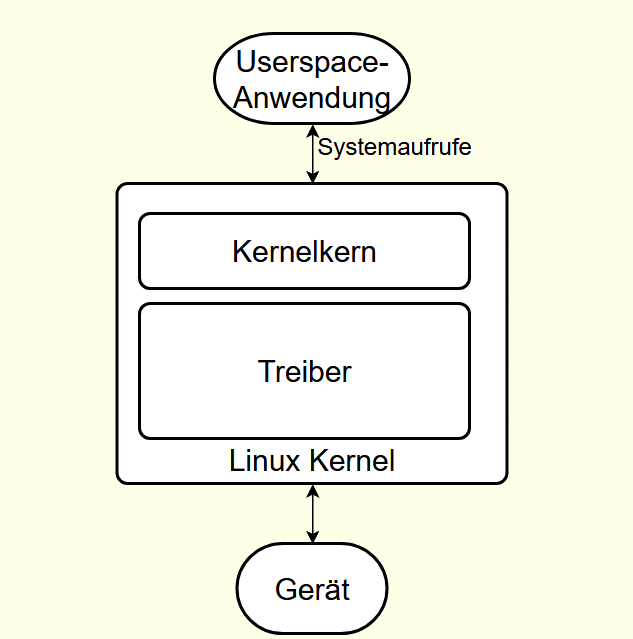
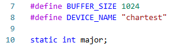
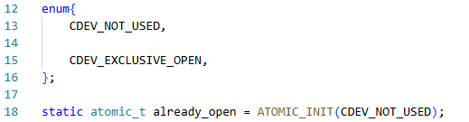
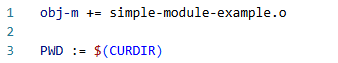
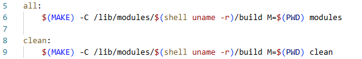
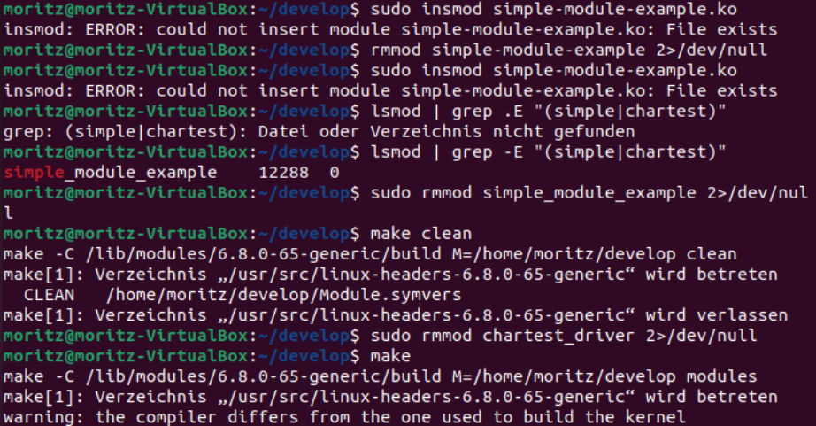

# Diplomarbeit Linux Treiber Dokumentation
\textauthor{Moritz Zugaj}

## Vorwort

Das Ziel dieses Dokuments ist die Aufzeichnung meiner Erfahrungen und anderen erwähnenswerten Notizen, welche als Prototyp der finalen schriftlichen Ausarbeitung dienen soll. Die Verwendung von LaTeX war eine stilistische Entscheidung und dient lediglich zur besseren Formatierung des Inhalts.

## Ausarbeitung

### Grundlagen zur Kernelprogrammierung in C

Die 5 wichtigsten Aspekte, die man vor dem Starten der Entwicklung verstehen muss.

#### Linux Kernel

Der Kernel eines Linux-Betriebssystems ist für die Speicher- und Prozessverwaltung zuständig. Er bildet eine unabhängige Schnittstelle für Software, welche auf die Schnittstelle zugreifen kann, ohne eine Ahnung von der Hardware zu haben. Der Linux Kernel ist ein modularer monolithischer Kernel, was so viel bedeutet, dass der Kernel nicht nur Funktionen für die Kommunikation zwischen Prozessen, sondern auch Treiber von Hardware bietet. Noch dazu kommt aber, dass der Kernel wie erwähnt auch modular ist, bedeutet, er kann durch jegliche Module verbessert werden.

#### Module

Module sind Codeteile welche auf dem Linux Kernel geladen und entfernt werden und dienen dazu, die Fähigkeiten des Kernels zu erweitern, ohne dabei einen Systemneustart zu verlangen. Ein Beispiel für ein wichtiges Modul im Linux Kernel ist der Geräte Treiber, der dafür dient, einen Schnittpunkt zwischen Hardware- und Kernelinteraktion herzustellen.



Damit ein Modul funktioniert und richtig geladen werden kann, muss es mindestens aus einer Startfunktion (init\_module) und einer Endfunktion (cleanup\_module) bestehen, damit der Code richtig geladen und komplett entfernt werden kann, so als hätte er niemals existiert.

#### Makefiles

Um die Kompilierung von den Quelltextdateien zu Programmmodulen bzw. Objekten zu steuern und nach Belieben anzupassen, verwendet man ein Makefile. Mit Makefile kann eine beliebige Anzahl an Quelltextdateien kompilieren aber auch miteinander zu einem einzelnen Programm linken, das alles funktioniert mit den sogenannten Targets, welche mit einem Doppelpunkt sichtbar markiert sind. Sie zeigen, welche Dateien kompiliert und miteinander verbunden werden sollen, da man auch ein Objekt aus mehreren Quelltextdateien erstellen kann.

```{caption="Makefile - Grundstruktur" .make}
obj_name := sourcefile_name.o

[target]: #dependent   
    #Command
```

Wichtig bei Makefiles zu beachten ist, dass statt Abständen Tabs verwendet werden müssen!

#### Header Files

Damit die Module fehlerfrei funktionieren, muss man die benötigten Header Files für den Kernel installieren. Die Header Files sind im Grunde Interfaces, welche Funktionen definieren, damit der Compiler weiß, ob diese richtig auf Basis der Signatur benutzt werden. Diese Header Files werden dann direkt als Erweiterung für den Kernel installiert, auf Ubuntu funktioniert das mit den Commands:

```{caption="Installation der Kernel Header Files" .bash}
sudo apt-get update 
apt-cache search linux-headers-`uname -r`
sudo apt-get install linux-headers-`uname -r`
```

**Wichtig!** Ich hatte anfangs Probleme mit Packages wie **printk.h** da meine Konfigurationsdatei (c\_cpp\_properties.json) nicht im Projektordner war.

#### Risiken

Die Stärke der Modulprogrammierung ist der Einfluss welchen das Modul auf den Kernel haben kann, was jedoch schnell auch zur Schwäche werden kann, da eine Zugriffsverletzung bei dem Modul auch zu einer Zugriffsverletzung am Kernel führen kann, da Module nicht ihren eigenen Code Bereich haben, sondern sie den des Kernels teilen. Dazu kommt noch, wenn der Code des Moduls in den Kernel geladen wird, dann kann es passieren, dass Variablen Namen gleich sind, kann es zu "Namespacepollution" führen. Deshalb ist es empfehlenswert, Module auf einer virtuellen Maschine oder anderen sicheren Umgebung zu testen, damit der mögliche Schaden keine Rolle spielt.

### Aufbau eines Treiber Moduls

In Linux teilen die meisten Treibermodule einen vorgesehenen Aufbau an Funktionen und anderen wichtigen Merkmalen, die man erlernen kann, jedoch unterscheiden sie sich auch in gewissen Punkten.

#### Device Files

Treiber Dateien oder wie in Linux genannt Driver Files repräsentieren je eine Art von Hardware, die mit dem Betriebssystem interagieren will bzw. kann, diese Driver Files stellen die Mittel zur Verfügung, damit mit der Hardware kommuniziert werden kann. Driver Files unter Linux befinden sich im /dev Folder und sind wie folgt aufgebaut:

```{caption="Beispiel eines Device Files in /dev" .bash}
brw-rw----  1 root  disk  8, 1 Apr  9  2025 /dev/sda1
```

Die drei wichtigsten Merkmale dieser File sind der erste Buchstabe, welcher die Art des Device repräsentiert (B für block und C für Character), die erste Ziffer nach Disk - in dem Fall 8 - ist die Major Nummer und besagt welcher Treiber für die Kommunikation dieses Gerätes zuständig ist und die Nummer danach, die sogenannte "minor" Nummer, die für den Treiber wichtig ist um zwischen seinen zuständigen Geräten zu differenzieren. Die Art des Gerätes ist wie gesagt in Block und Charakter geteilt, wobei Block einen Buffer für Lese- und Schreibmethode zur Verfügung stellt, was für Speichergeräte von Vorteil ist, während Character die Möglichkeit bietet, die Anzahl der Bytes, die sie nutzen, nach Belieben anzupassen, was Flexibilität fördert und daher der Typ der meisten Geräte ist.

Wie schon erwähnt, befinden sich alle Driver Files im Ordner /dev. Sobald man also mit seiner eigenen Driver File fertig ist, muss man zum Schluss seine File vom Arbeitsordner in /dev geben.

#### Datei Operatoren

Die Struktur der Datei Operatoren (File operators) ist definiert unter (include/linux/fs.h) und beinhaltet Pointer für Funktionen, die im Treiber definiert sind und verschiedene Funktionen auf dem Treiber ausführen. Einer der wichtigsten Operatoren ist das Einlesen vom Gerät, welches in jedem Character Gerätetreiber definiert ist, da es ein Must-have ist, im Gegensatz zu gewissen Block-Treibern wo die Funktion einfach mit Null supplementiert wird.

Durch gcc (Gnu Compiler Collection) Erweiterungen ist es heutzutage deutlich einfacher, etwas zu der Struktur zuzuweisen:

```{caption="File Operations Struktur - gcc-Erweiterung" .c}
struct file_operation fops = {
  read: device_read, 

  write: device_write, 

  open: device_open, 

  release: device_release 
};
```

Der Kompatibilität halber ist es empfohlen, dass die "fops" Instanz so implementiert werden soll:

```{caption="File Operations Struktur - empfohlene Implementierung" .c}
struct file_operation fops = {
  .read = device_read, 

  .write = device_write, 

  .open = device_open, 

  .release = device_release 
};
```

#### Gerät-Registrierung

Wenn ein Character Gerät erreicht werden will, muss eine Geräte File in /dev sein, diese Dateien sind jedoch abstrakt, offen und operieren in Kernel Space. Um einen fertigen Treiber ins System einzufügen, muss es erst in den Kernel registriert werden:

```{caption="Gerät-Registrierung - register\_chrdev" .c}
int register_chrdev(unsigned int major, const char *name, 
struct file_operations *fops);
```

Damit die erstellte Geräte Datei alle "Minor" Nummern verwendet gibt es zwei bessere Interfaces die sich nur darin unterscheiden, ob man die "Major" Nummer kennt oder eine dynamisch zugewiesene haben will:

```{caption="Gerät-Registrierung - register\_chrdev\_region \& alloc\_chrdev\_region" .c}
int register_chrdev_region(dev_t from, unsigned count,
const char *name); 

int alloc_chrdev_region(dev_t *dev, unsigned baseminor,
unsigned count, const char *name);
```

Diese abstrakten Dateien sind nicht im "Disk-Space" vorhanden, werden aber von der Datenstruktur Inode (Index Node) repräsentiert. Inode enthält mithilfe von Metadaten alle Informationen über die File, mit zwei Ausnahmen: der Name der Datei und der Pfad. Jedoch dient die Inode Nummer als Pointer zu dem richtigen Inode, damit die Metadaten leicht gefunden werden können.

Wichtig bei der Registrierung ist noch, dass wir bei der Major Nummer 0 setzen müssen, damit der Kernel uns eine noch nicht zugewiesene Major Number zur Verfügung gibt und erst dann können wir folgendermaßen die Gerätedatei (Device File) erstellen.

#### Gerät-Entregistrierung

Es sollte nicht möglich sein, dass Root ein Treiber Modul, was gerade im Linux Kernel einen Prozess durchläuft, mit rmmod entfernt, da es dann zu großen Problemen im Kernel führen kann, da Code von einem anderen Modul inmitten einer Funktion ausgeführt werden kann. Deshalb gibt es einen Zähler, der darauf achtet, wie oft das Modul gerade verwendet wird, wenn dieser Counter auf 0 ist - also gerade wird das Modul nicht in Betrieb genutzt - dann ist es gestattet auch ein rmmod anzuwenden.

#### Datei-Systeme

<!-- Inhalt folgt -->

### Coding Style im Linux Kernel

Der Linux Kernel hat einen sehr strikten Coding Style, welcher in dem offiziellen Linux Kernel Coding Style Dokument beschrieben wird. Hier sind einige der wichtigsten Regeln:

**Einrückungen** sind 8 Zeichen lang damit man sie gut erkennen kann.

```{caption="Coding Style - Einrückungen" .c}
if(i == 1){
        printf("i ist 1\n"); // <-- 8 Zeichen abstand statt 4.
        return i;
}
```

**Funktionen** haben die Öffnungsklammer am Anfang der nächsten Linie und alle nicht-Funktionen haben sie am Ende der gleichen Zeile nach dem Vorbild von Kernighan und Ritchie.

```{caption="Coding Style - Klammern bei Funktionen" .c}
static int myIntFunktion(int var)
{ // <--
        //code 
}

static struct my_struct ={ // <--
        //code
}
```

**Typedefs** sollten zur Verständlichkeit des Codes nicht verwendet werden!

```{caption="Coding Style - Typedefs" .c}
vps_t a; //schlecht

struct virtual_container *a; //in ordnung
```

Dazu kommen noch andere bereits erwähnte Aspekte wie das Bewusstsein bei der Namensgebung der Variablen.

### Schritt für Schritt Vorführung einer Linux Treiber Entwicklung in C

Jetzt wird anhand des bereits besprochenen Aufbaus eines Treibermoduls Theorie in die Praxis umgesetzt und anhand der gesammelten Erfahrung schrittweise ein einfaches Treibermodul erstellt werden.

#### Zielsetzung

Das Treibermodul soll folgende Funktionen haben:

* Eine Initial Funktion um vom Kernel geladen werden zu können.
* Eine Öffnungsfunktion, damit man weiß, ob die Gerätedatei bereits geöffnet ist.
* Eine Schließfunktion, damit man weiß, wenn die geöffnete Gerätedatei wieder geschlossen wurde.
* Eine Schreib Funktion.
* Eine Lesefunktion.
* Zum Schluss noch eine cleanup Funktion, damit es auch entladen werden kann.

#### Vorgehensweise

Bevor man mit dem eigentlichen Modul beginnt sollte man die Header Files sowie die benötigten Packages installieren (siehe Abschnitt Header Files).

Insgesamt müssen vor der Erzeugung der Kernel-Objekt-Datei zwei Dateien vorhanden sein: Eine .c Datei welche den Quellcode beinhaltet, also alle Funktionen die das Modul letztendlich können muss. Und die Makefile welche die .c Datei als Modul verweist und bei der Kompilierung zur Objekt-Datei und anschließend Kernel-Objekt-Datei eine wichtige Rolle spielt, da sie der .o Datei die benötigten Metadaten hinzufügt.

#### Umsetzung der C-Datei

Damit man alle notwendigen Bibliotheken hat fügen wir sie in der Kopfzeile hinzu:


Die module.h Bibliothek ist das Herzstück des Kernel Moduls da es die wesentlichen Funktionen und Macros bereitstellt. Wir verwenden die Bibliothek hauptsächlich für die init()- und exit()-Funktionen sowie um auf das Modul zu referenzieren. Die Macros für Kernel Nachrichten wie pr\_alert oder pr\_info sind in printk.h definiert. fs.h beinhaltet wie bereits erwähnt die File Operatoren, Pointer zu der File Struktur sowie die Datei-Registrierungs Funktion. Ebenfalls bereits erwähnt wurden die copy\_to\_user und copy\_from\_user Macros welche in uaccess.h bereitgestellt werden. Abschließend stellt kernel.h die benötigten Atomaren Typen und Funktionen bereit, die versichern, dass ein Prozess ununterbrochen das Gerät offen haben kann, ohne dabei von anderen gestört zu werden.

Als nächstes definieren wir zwei Macros welche für die Lesefunktion, Schreibfunktion und die Ausgabe gebraucht werden:



Dem Buffer wurden 1024 Bytes zugewiesen welche er benutzen kann um Daten welche vom Userspace geschrieben worden sind zu speichern und später in der Lesefunktion wieder zurückzugeben. Das Gerät wurde der Simplizität halber "chartest" getauft. Zusätzlich brauchen wir eine Variable, welche die Major Number enthält die vom Kernel zugewiesen wird sobald die Registrierung erfolgt.

Die erste Funktion die wir schreiben ist die Öffnungsfunktion "device\_open". Um zu garantieren, dass der Zugang exklusiv ist und in einem Umfeld mit mehreren Prozessen richtig verfolgt werden kann, müssen Zustands-Enums sowie eine atomare Variable definiert werden:



CDEV\_NOT\_USED ist hierbei 0 was soviel wie frei bedeutet und CDEV\_EXCLUSIVE\_OPEN ist 1 was besetzt angibt. (CDEV wird hierbei als Alias für Character Device verwendet). atomic\_t ist eine spezielle Integer-Variable die in einer "Multi-Thread" Umgebung sicherstellt, dass die Operationen Atomar sind und damit verhindert, dass Locks gebraucht werden. ATOMIC\_INIT() initialisiert die Variable auf den Zustand CDEV\_NOT\_USED.

Was anfangs verwirrend erscheinen kann, besonders wenn man sich mehrere ältere Treibermodule im Linux Kernel ansieht, sind die verschiedenen Signaturen bei denselben Funktionen. Dies sind Angewohnheiten der Namensgebung die sich mit der Zeit ändern - zum Beispiel bei einem Pointer zu einer Variable file hätte man statt \*file früher \*filp - aber da es aus der Sicht des Kernels keine Rolle spielt sollte dies im Großen und Ganzen ignoriert werden.

#### Umsetzung der MakeFile

Jetzt wo die C-Datei fertig ist braucht es nur noch eine Anleitung für den Kernel, aus welchem Code was erstellt werden soll, und diese Rolle übernimmt die Makefile. Damit der erste Schritt erfüllt werden kann müssen wir angeben, dass aus "simple-module-example.c" eine Objektdatei und schließlich eine Kernel-Objektdatei erzeugt werden soll:



Die erste Zeile sagt dem Kernel, dass simple-module-example.o ein ladbares Kernel Objekt wird und aus diesem ein Modul (.ko) erstellt werden soll. Die andere Option wäre obj-y was bedeuten würde, dass es als "Built-in" Kernel Objekt erstellt wird. Als nächstes wird dem Kernel gesagt in welchem Pfad die Modul Quelle ist, PWD gibt das aktuelle Verzeichnis an und \$(CURDIR) verweist auf das Arbeitsverzeichnis.



Alle unter dem Standard-Ziel "all:" stehenden Commands werden ausgelöst sobald "make" in der Shell ausgeführt wird. Gleich wie bei "all:" hat das "clean:" Ziel die gleiche Struktur, nur wird es bei "make clean" ausgeführt.

#### Kompilierung im Linux Terminal

Ein Problem was bei mir auftrat war, dass mein Kernel mit GNU Compiler Collection Version 12 (gcc-12) installiert wurde und daher versucht, den gleichen Compiler für Module zu benutzen. Die einfachste Lösung ist es, die gcc-Version die vom Kernel benutzt wird zu installieren:

```{caption="Installation der passenden gcc-Version" .bash}
sudo apt update
sudo apt install gcc-12
```



### Analytischer Vergleich zwischen C und Rust im Linux-Kernel
