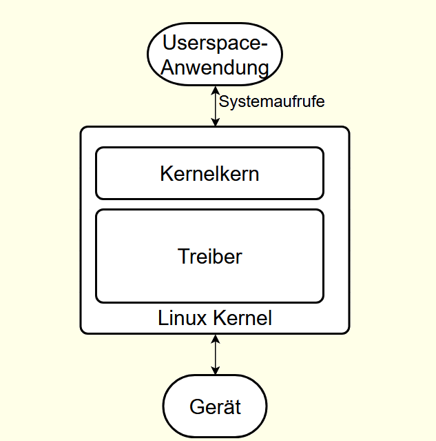

# Diplomarbeit Linux Treiber Dokumentation Zugaj
\textauthor{Moritz Zugaj}

## Theoretische Ausarbeitung

### Grundlagen zur Kernelprogrammierung in C

Die 5 wichtigsten Aspekte, die man vor dem Starten der Entwicklung verstehen muss.

#### Linux Kernel

Der Kernel eines Linux-Betriebssystems ist für die Speicher- und Prozessverwaltung zuständig. Er bildet eine unabhängige Schnittstelle für Software, welche auf die Schnittstelle zugreifen kann, ohne Kenntnis der Hardware zu haben. Der Linux-Kernel ist ein modularer monolithischer Kernel, was so viel bedeutet, dass der Kernel nicht nur Funktionen für die Kommunikation zwischen Prozessen, sondern auch Treiber von Hardware bietet. Noch dazu kommt, dass der Kernel, wie erwähnt, auch modular ist, das bedeutet, er kann durch jegliche Module erweitert werden [@docs_driver_basics].

#### Module

Module sind Codeteile, welche auf dem Linux-Kernel geladen und entfernt werden und dienen dazu, die Fähigkeiten des Kernels zu erweitern, ohne dabei einen Systemneustart zu verlangen. Ein Beispiel für ein wichtiges Modul im Linux-Kernel ist der Gerätetreiber, der dazu dient, einen Schnittpunkt zwischen Hardware- und Kernelinteraktion herzustellen [@lkmpg_sysprog21].



Damit ein Modul funktioniert und richtig geladen werden kann, muss es mindestens aus einer Startfunktion `init_module` und einer Endfunktion `cleanup_module` bestehen, damit der Code richtig geladen und komplett entfernt werden kann, so als hätte er niemals existiert [@lkmpg_sysprog21].

#### Makefiles

Um die Kompilierung der Quelltextdateien zu Programmmodulen bzw. Objekten zu steuern und nach Belieben anzupassen, verwendet man ein Makefile. Mit Makefile kann eine beliebige Anzahl an Quelltextdateien kompiliert, aber auch miteinander zu einem einzelnen Programm gelinkt werden; das alles funktioniert mit den sogenannten Targets, welche mit einem Doppelpunkt sichtbar markiert sind. Sie zeigen, welche Dateien kompiliert und miteinander verbunden werden sollen, da man auch ein Objekt aus mehreren Quelltextdateien erstellen kann [@docs_kbuild_external_modules].

```makefile
obj_name := sourcefile_name.o

[target]: #dependent   
    #Command
```

Wichtig bei Makefiles zu beachten ist, dass statt Abständen Tabs verwendet werden müssen!

#### Header Files

Damit die Module fehlerfrei funktionieren, muss man die benötigten Header-Files für den Kernel installieren. Die Header-Files sind im Grunde Interfaces, welche Funktionen definieren, damit der Compiler weiß, ob diese richtig auf Basis der Signatur benutzt werden. Diese Header-Files werden dann direkt als Erweiterung für den Kernel installiert; auf Ubuntu funktioniert das mit den Commands [@docs_driver_basics]:

```bash
sudo apt-get update 
apt-cache search linux-headers-`uname -r`
sudo apt-get install linux-headers-`uname -r`
```

**Wichtig!** Ich hatte anfangs Probleme mit Packages wie **printk.h**, da meine Konfigurationsdatei (c\_cpp\_properties.json) nicht im Projektordner war.

#### Risiken

Die Stärke der Modulprogrammierung ist der Einfluss, welchen das Modul auf den Kernel haben kann, was jedoch schnell auch zur Schwäche werden kann, da eine Zugriffsverletzung bei dem Modul auch zu einer Zugriffsverletzung am Kernel führen kann, da Module nicht ihren eigenen Codebereich haben, sondern den des Kernels teilen. Dazu kommt noch, wenn der Code des Moduls in den Kernel geladen wird, dass es passieren kann, dass Variablennamen gleich sind, was zu *Namespace-Pollution* führen kann. Deshalb ist es empfehlenswert, Module auf einer virtuellen Maschine oder in einer anderen sicheren Umgebung zu testen, damit der mögliche Schaden keine Rolle spielt [@lkmpg_sysprog21] [@docs_driver_basics].

### Aufbau eines Treibermoduls

In Linux teilen die meisten Treibermodule einen vorgesehenen Aufbau an Funktionen und anderen wichtigen Merkmalen, die man erlernen kann, jedoch unterscheiden sie sich auch in gewissen Punkten.

#### Device Files

Device Files repräsentieren jeweils eine Art von Hardware, die mit dem Betriebssystem interagieren will bzw. kann; diese Device Files stellen die Mittel zur Verfügung, damit mit der Hardware kommuniziert werden kann. Device Files unter Linux befinden sich im /dev-Folder und sind wie folgt aufgebaut [@linux_kernel_labs_chardev]:

```bash
brw-rw----  1 root  disk  8, 1 Apr  9  2025 /dev/sda1
```

Die drei wichtigsten Merkmale dieser File sind der erste Buchstabe, welcher die Art des *Device* repräsentiert (b für block und c für character), die erste Ziffer nach disk — in dem Fall 8 — ist die Major-Nummer und besagt, welcher Treiber für die Kommunikation dieses Gerätes zuständig ist, und die Nummer danach, die sogenannte *minor*-Nummer, die für den Treiber wichtig ist, um zwischen seinen zuständigen Geräten zu differenzieren. Die Art des Gerätes ist wie gesagt in Block und Character geteilt, wobei Block einen *Buffer* für Lese- und Schreibmethoden zur Verfügung stellt, was für Speichergeräte von Vorteil ist, während Character die Möglichkeit bietet, die Anzahl der Bytes, die sie nutzen, nach Belieben anzupassen, was Flexibilität fördert und daher der Typ der meisten Geräte ist [@linux_kernel_labs_chardev].

Wie schon erwähnt, befinden sich alle Device Files im Ordner /dev. Sobald man also mit seiner eigenen Device File fertig ist, muss man zum Schluss seine File vom Arbeitsordner in /dev verschieben.

#### Dateioperatoren

Die Struktur der Dateioperatoren (file operations) ist definiert unter (include/linux/fs.h) und beinhaltet *Pointer* für Funktionen, die im Treiber definiert sind und verschiedene Funktionen auf dem Treiber ausführen. Einer der wichtigsten Operatoren ist das Einlesen vom Gerät, welches in jedem Character-Gerätetreiber definiert ist, da es ein Must-have ist, im Gegensatz zu gewissen Block-Treibern, wo die Funktion einfach mit NULL supplementiert wird [@docs_driver_basics].

Durch gcc (*GNU Compiler Collection*)-Erweiterungen ist es heutzutage deutlich einfacher, etwas zu der Struktur zuzuweisen:

```c
struct file_operation fops = {
  read: device_read, 

  write: device_write, 

  open: device_open, 

  release: device_release 
};
```

Der Kompatibilität halber ist es empfohlen, dass die "fops"-Instanz folgendermaßen implementiert werden soll:

```c
struct file_operation fops = {
  .read = device_read, 

  .write = device_write, 

  .open = device_open, 

  .release = device_release 
};
```
\newpage
#### Gerät-Registrierung

Wenn ein Character-Gerät erreicht werden will, muss eine Geräte-Datei in `/dev` vorhanden sein; diese Dateien sind abstrakt, offen und operieren im Kernel-Space. Um einen fertigen Treiber ins System einzufügen, muss er zuerst im Kernel registriert werden [@linux_kernel_labs_chardev]:

```c
int register_chrdev(unsigned int major, const char *name, 
struct file_operations *fops);
```

Damit die erstellte Geräte-Datei alle minor-Nummern verwendet, gibt es zwei weitere Interfaces, die sich nur darin unterscheiden, ob man die *major*-Nummer kennt oder eine dynamisch zugewiesene haben will [@linux_kernel_labs_chardev]:

```c
int register_chrdev_region(dev_t from, unsigned count,
const char *name); 

int alloc_chrdev_region(dev_t *dev, unsigned baseminor,
unsigned count, const char *name);
```

Diese abstrakten Dateien sind nicht im *Disk-Space* vorhanden, werden aber von der Datenstruktur *inode* (*index node*) repräsentiert. Inode enthält mithilfe von Metadaten alle Informationen über die Datei, mit zwei Ausnahmen: der Name der Datei und der Pfad; jedoch dient die Inode-Nummer als Pointer zu dem richtigen Inode, damit die Metadaten leicht gefunden werden können.

Wichtig bei der Registrierung ist noch, dass bei der Major-Nummer 0 gesetzt werden muss, damit der Kernel eine noch nicht zugewiesene Major-Nummer zur Verfügung gibt, und erst dann kann man folgendermaßen die Gerätedatei (device file) erstellen.

#### Gerät-Deregistrierung

Es sollte nicht möglich sein, dass Root ein Treibermodul, das gerade im Linux-Kernel einen Prozess durchläuft, mit `rmmod` entfernt, da es dann zu großen Problemen im Kernel führen kann, da Code von einem anderen Modul inmitten einer Funktion ausgeführt werden kann. Deshalb gibt es einen Zähler, der darauf achtet, wie oft das Modul gerade verwendet wird; wenn dieser Counter auf 0 ist, also das Modul gerade nicht in Betrieb ist, dann ist es gestattet, auch ein `rmmod` anzuwenden [@lkmpg_sysprog21].

#### Dateisysteme

Ein verwandtes Thema der erwähnten Inodes sind Dateisysteme. Dateisysteme wie `proc` erlauben eine weitere Möglichkeit für den Kernel und die Kernel-Module, Informationen zu senden und zu verarbeiten. Aber `proc` gibt auch von sich aus wichtige Informationen über den Prozess, wie zum Beispiel Informationen über alle vorhandenen Module oder eine Statistik über die Speicherverwendung. Die Methode, `proc` zu erstellen und auszuführen, ist sehr ähnlich wie bei den Modulen, da wir eine Struktur erstellen müssen mit allen Informationen der `/proc`-Datei, sowie Pointern zu allen Funktionen, und zu guter Letzt haben wir wieder die Initialisierungsfunktion zum Registrieren und die Aufräumfunktion zum Entregistrieren. Im simpelsten Fall haben wir dann noch mindestens eine Lesmethode, damit etwas zurückgegeben wird, wenn wir lesen möchten [@lkmpg_sysprog21].

### Best Practices im Code

Wenn man sich die auf GitHub vorhandenen Treibermodule ansieht, stößt man immer wieder auf kleine Tricks im Code, die die Quality of Life verbessern. Diese Tricks sind leicht zu implementieren und sollten deshalb, wenn möglich, immer angewandt werden.

#### Makros

Wie schon früher erwähnt, braucht ein jedes Modul mindestens eine Initialisierungs- und Aufräum-Funktion, damit sie richtig vom System registriert und unregistriert werden können. Die `__init`- und `__exit`-Makros erlauben den Wegfall der beiden Funktionen nach der Verwendung bzw. wenn die Funktion nicht gebraucht wird, um RAM-Speicher freizuräumen. Dies ist natürlich nur bei sogenannten *built-in*-Modulen möglich, da bei ladbaren Modulen die Funktionen nicht einfach weggeworfen werden dürfen, da diese für Laufzeitverwaltung und Entladeoperationen notwendig sind [@lkmpg_sysprog21].

Ein weiterer Fall, wo Makros hilfreich sind, ist, wenn Daten vom Userspace (Prozess) zum Kernelspace (Linux-Kernel) transportiert werden müssen. Dies wird zum Beispiel bei der Schreibfunktion von Dateisystemen gebraucht und dafür gibt es die Makros `put_user` und `get_user` für einzelne Zeichen, sowie `copy_to_user` und `copy_from_user`. Natürlich war das nur ein Beispiel, da es noch hunderte weitere hilfreiche Makros gibt [@lkmpg_sysprog21].

#### Debugging

Für die Fehlersuche und Vermeidung können ebenfalls Makros hilfreich sein. Vor allem der Tracepoint-Macro `ftrace` kann Profilabschnitte erstellen, welche benutzt werden können, um komplexe Treiber zu verstehen und eigene zu debuggen. Eine Möglichkeit ist es auch, den Kernel neu zu kompilieren, um hilfreiche Funktionen wie `MODULE_FORCE_UNLOAD` zu aktivieren; dies bietet die Möglichkeit, jegliches Modul mit dem `sudo rmmod -f`-Befehl zu entladen, selbst wenn der Kernel es als unsicher ansieht. Für die allgemeine Ausgabe von Kernel-Log-Nachrichten wird `printk()` verwendet, welches das Äquivalent zu `printf()` im Kernelspace ist.

#### Coding-Stil

Damit man Code in den Linux-Kernel bekommt, muss man den vorgesehenen Coding-Stil beachten, der perfekt einzuhalten ist, oder man bekommt die *Pull-Request* konsequenterweise abgelehnt. Wenn man es nicht beabsichtigt, seinen Code in den Linux-Kernel zu committen, ist es zwar nicht zwingend, aber sehr empfohlen, auf den Stil der Autoren zu wechseln [@kernel_docs_coding_style]. Dazu zählt:

**Statements** über 80 Zeichen sollten geteilt werden, damit man die Lesbarkeit verbessert.

```c
if (device->config_table[CONFIG_INDEX]->subsystem->handler->...
    return -EINVAL;

//stattdessen:

if (device->config_table[CONFIG_INDEX]->subsystem->handler->
ops->init(device, CONFIG_MODE_HIGH, true) < 0)
    return -EINVAL
```

**Einrückungen** sind 8 Zeichen lang, damit man sie gut erkennen kann.

```c
if(i == 1){
        printf("i ist 1\n"); // <-- 8 Zeichen Abstand statt 4.
        return i;
}
```

**Funktionen** haben die Öffnungsklammer am Anfang der nächsten Zeile und alle Nicht-Funktionen haben sie am Ende der gleichen Zeile nach dem Vorbild von Kernighan und Ritchie.

```c
static int myIntFunktion(int var)
{ // <--
        //code 
}

static struct my_struct ={ // <--
        //code
}
```

**Typedefs** sollten zur Verständlichkeit des Codes nicht verwendet werden!

```c
vps_t a; //schlecht

struct virtual_container *a; //in Ordnung
```

Dazu kommen noch andere bereits erwähnte Aspekte wie das Bewusstsein bei der Namensgebung der Variablen.

### Schritt-für-Schritt Entwicklung eines Linux Treibers in C

Anhand des bereits besprochenen Aufbaus eines Treibermoduls kann man jetzt Theorie in die Praxis umsetzen und mithilfe der gesammelten Erfahrung schrittweise ein einfaches Treibermodul erstellen. Die praktische Implementierung wurde innerhalb einer virtuellen Maschine (VirtualBox) umgesetzt.

#### Zielsetzung

Das Treibermodul soll folgende Funktionen haben:

* Eine Initialfunktion, um vom Kernel geladen werden zu können.
* Eine Öffnungsfunktion, damit man weiß, ob die Gerätedatei bereits geöffnet ist.
* Eine Schließfunktion, damit man weiß, wenn die geöffnete Gerätedatei wieder geschlossen wurde.
* Eine Schreibfunktion.
* Eine Lesefunktion.
* Zum Schluss noch eine Cleanup-Funktion, damit es auch entladen werden kann.

#### Vorgehensweise

Bevor man mit dem eigentlichen Modul beginnt, sollte man die Header-Files sowie die benötigten Packages installieren (siehe Abschnitt Header Files).

Insgesamt müssen vor der Erzeugung der Kernel-Objekt-Datei zwei Dateien vorhanden sein: Eine C Datei, welche den Quellcode beinhaltet, also alle Funktionen, die das Modul letztendlich beherrschen muss, und das Makefile, welche die C Datei als Modul verweist und bei der Kompilierung zur Objektdatei und anschließend Kernel-Objektdatei eine wichtige Rolle spielt, da sie der .o-Datei die benötigten Metadaten hinzufügt [@docs_kbuild_external_modules].

#### Umsetzung der C-Datei

Damit man alle notwendigen Bibliotheken hat, fügen wir sie in den Kopfzeilen hinzu:

```c
#include <linux/module.h>
#include <linux/printk.h>
#include <linux/fs.h>
#include <linux/uaccess.h>
#include <linux/kernel.h>
```

Die `module.h`-Bibliothek ist das Herzstück des Kernel-Moduls, da sie die wesentlichen Funktionen und Makros bereitstellt; wir verwenden die Bibliothek hauptsächlich für die `init()`- und `exit()`-Funktionen sowie um auf das Modul zu referenzieren. Die Makros für Kernel-Nachrichten wie `pr_alert` oder `pr_info` sind in `printk.h` definiert. `fs.h` beinhaltet, wie bereits erwähnt, die File-Operatoren, Pointer zu der File-Struktur sowie die Datei-Registrierungsfunktion. Auch bereits erwähnt wurden die `copy_to_user` und `copy_from_user`-Macros, welche in `uaccess.h` bereitgestellt werden. Abschließend stellt `kernel.h` die benötigten atomaren Typen und Funktionen bereit, die versichern, dass ein Prozess ununterbrochen das Gerät offen haben kann, ohne dabei von anderen gestört zu werden.

Als nächstes definieren wir zwei Makros, welche für die Lesefunktion, Schreibfunktion und die Ausgabe gebraucht werden:

```c
#define BUFFER_SIZE 1024
#define DEVICE_NAME "chartest"

static int major;
```

Dem Buffer wurden 1024 Bytes zugewiesen, welche er benutzen kann, um Daten, welche vom Userspace geschrieben worden sind, zu speichern und später in der Lesefunktion wieder zurückzugeben. Das Gerät wurde der Einfachheit halber "chartest" getauft. Zusätzlich brauchen wir eine Variable, welche die Major-Number enthält, die vom Kernel zugewiesen wird, sobald die Registrierung erfolgt.

Die erste Funktion, die wir schreiben, ist die Öffnungsfunktion `device_open`. Um zu garantieren, dass der Zugang exklusiv ist und in einem Umfeld mit mehreren Prozessen richtig verfolgt werden kann, müssen zuständige Enums sowie eine atomare Variable definiert werden:

```c
enum{
    CDEV_NOT_USED,

    CDEV_EXCLUSIVE_OPEN,
};
```

`CDEV_NOT_USED` ist hierbei 0, was so viel wie frei bedeutet, und `CDEV_EXCLUSIVE_OPEN` ist 1, was besetzt angibt. (CDEV wird hierbei als Alias für Character Device verwendet). `atomic_t` ist eine spezielle Integer-Variable, die in einer *multi-threaded*-Umgebung sicherstellt, dass die Operationen atomar sind und damit verhindert, dass Locks gebraucht werden. `ATOMIC_INIT()` initialisiert die Variable auf den Zustand `CDEV_NOT_USED`.
\newpage
Jetzt wird die Funktion `device_open` deklariert:

```c
static atomic_t already_open = ATOMIC_INIT(CDEV_NOT_USED);

static int device_open(struct inode *inode, struct file *file)
{
    static int counter = 0;

    if (atomic_cmpxchg(&already_open, CDEV_NOT_USED, CDEV_EXCLUSIVE_OPEN))
    
        return -EBUSY;

    pr_info("You opened this %d times\n", counter++);

    return 0;
}
```

Als Parameter geben wir Pointer an, die zu dem inode- und file-Struct zeigen. Das inode-Struct repräsentiert die Metadaten einer Datei, während das file-Struct Dateioperationen, Positionen und Flaggen bereitstellt. Jedes Mal, wenn die Funktion aufgerufen wird, wird gleichzeitig eine Instanz dieser beiden Strukturen erstellt.

Was anfangs verwirrend erscheinen kann, besonders wenn man sich mehrere ältere Treibermodule im Linux-Kernel ansieht, sind die verschiedenen Signaturen bei denselben Funktionen. Dies sind Angewohnheiten der Namensgebung, die sich mit der Zeit ändern; zum Beispiel bei einem Pointer zu einer Variable file hätte man statt \*file früher \*filp verwendet, aber da es aus der Sicht des Kernels keine Rolle spielt, sollte dies im Großen und Ganzen ignoriert werden.

Damit das Öffnen des Gerätes atomar abläuft, wird die Funktion `atomic_cmpxchg` (*atomic compare and exchange*) genutzt. Wenn `CDEV_NOT_USED` zutrifft, dann ändert sich der Status auf `CDEV_EXCLUSIVE_OPEN` und 0 wird zurückgegeben, was bedeutet, dass das Gerät geöffnet werden kann. Wenn jedoch `CDEV_EXCLUSIVE_OPEN` zutrifft, dann bleibt der Status gleich und 1 wird zurückgegeben, was `-EBUSY;` auslöst und der Öffnungs-Systemaufruf scheitert.

Zudem hat die Funktion noch einen *Counter*, welcher mitzählt, wie oft das Gerät erfolgreich geöffnet wurde.

Wenn die Datei vom Prozess geschlossen wird, wird die `device_release()`-Funktion aufgerufen:

```c
static int device_release(struct inode *inode, struct file *file)
{
    atomic_set(&already_open, CDEV_NOT_USED);

    pr_info("closed\n");
    return 0;
}
```

Mithilfe von `atomic_set()` wird der Status zu nicht benutzt zurückgesetzt und eine Nachricht des Schließereignisses wird im Kernel-Log ausgegeben.

Um die Schreib- und Lesefunktion richtig verwenden zu können, muss der vorhin definierte 1024-Byte-Buffer im Kernelspace zugeteilt werden. Für die dynamische Speicherverwaltung im Kernelspace wird `kmalloc()` verwendet, welches physisch zusammenhängenden Speicher zurückgibt, und mit `kfree()` wieder freigegeben werden muss.

```c
static char kernel_buffer[BUFFER_SIZE];
```

Sobald Leseaufrufe vom Userspace kommen, muss die Lesefunktion aufgerufen werden. Die Hilfsfunktion `simple_read_from_buffer()` nutzt den `copy_to_user`-Macro, um die Daten in den Userspace zu kopieren und dort im vorhandenen Buffer zu lesen. Die Parameter sind folgend zu verstehen:

* `buff` ist der Userspace-Buffer, also das Ziel
* `length` ist die gewünschte Länge
* `offset` ist die aktuelle Leseposition
* `kernel_buffer` und `BUFFER_SIZE` sind jeweils die Quelle im Kernel und die Größe des Buffers.

```c
static ssize_t device_read(struct file *file, char __user *buff,
    size_t length, loff_t *offset)
{
    return simple_read_from_buffer(buff, length, offset, 
        kernel_buffer, BUFFER_SIZE);
}
```

Wenn das Benutzerprogramm schreibt, muss `device_write()` aufgerufen werden:

```c
static ssize_t device_write(struct file *file, const char __user *buff,
    size_t len, loff_t *offset)
{
    if (len >= BUFFER_SIZE)
        len = BUFFER_SIZE - 1;


    if (copy_from_user(kernel_buffer, buff, len))
        return -EFAULT;

    pr_info("successfully written into %s\n", DEVICE_NAME);
    return len;
}
```

Zuerst muss geschaut werden, dass der Benutzer nicht über den Buffer hinausschreibt; das wird mit der ersten if-Bedingung gesichert. Dann wird das Gegenteil der Lesefunktion ausgeführt und der Buffer im Userspace wird in den Kernelspace kopiert. Wenn etwas schiefläuft, beispielsweise wegen einem fehlerhaften Pointer, wird `-EFAULT` zurückgegeben, was die Nachricht "Bad memory address" zurückgibt und den Vorgang abbricht. Ansonsten wird eine Erfolgsnachricht in den Kernel-Log geschrieben.

Als nächstes werden die Dateioperatoren definiert und initialisiert. Wie schon in früheren Kapiteln erwähnt, sind Dateioperationen dazu da, Systemaufrufe den jeweiligen Funktionen zuzuordnen.

```c
static struct file_operations fops = {
    .owner = THIS_MODULE,
    .open = device_open,
    .release = device_release,
    .read = device_read,
    .write = device_write,
};
```

Zum Schluss müssen noch die Start- und Endfunktion definiert werden:

Der Makro `__init` markiert, dass die Funktion *init-only* ist, was bedeutet, dass der Speicher nach der Beendigung freigegeben wird. In der Startfunktion wird die Major-Nummer mithilfe von `register_chrdev()` initialisiert. In dem Fall nutzen wir die simplere Variante, welche nicht behutsam mit den minor-Nummern umgeht, aber um es so einfach wie möglich zu halten, genügt das. Als Parameter wird 0 übergeben, was so viel bedeutet wie, dass die Major-Nummer automatisch zugewiesen wird, und der Name des Geräts. Wenn die Major-Nummer unter 0 ist, wird eine Nachricht an den Kernel-Log geschickt und die Nummer zurückgegeben [@linux_kernel_labs_chardev].

```c
static int __init startfunction(void)
{   
    major = register_chrdev(0, DEVICE_NAME, &fops);

    if (major < 0){
    
        pr_alert("failed to register character device\n");
    
        return major;
    }

        pr_info("begin %s\n",DEVICE_NAME);
        return 0;
}
```

Der Makro `__exit` markiert, dass es nicht in den Speicher geladen wird, sollte es ein built-in Modul sein. `unregister_chrdev` bereinigt die Geräte-Registration und zum Schluss wird eine abschließende Nachricht an den Kernel-Log geschickt [@lkmpg_sysprog21].

```c
static void __exit endfunction(void)
{

    unregister_chrdev(major, DEVICE_NAME);

    pr_info("finished %s\n",DEVICE_NAME);
}
```

Zuletzt werden noch die Lade- und Entladefunktionen registriert und die Lizenz-, Autor- und Beschreibungs-Metadaten angegeben.

```c
module_init(startfunction);
module_exit(endfunction);

MODULE_LICENSE("GPL");
MODULE_AUTHOR("Moritz");
MODULE_DESCRIPTION("basic device-module structure");
```

#### Umsetzung der MakeFile

Jetzt, wo die C-Datei fertig ist, braucht es nur noch eine Anleitung für den Compiler, aus welchem Code was erstellt werden soll, und diese Rolle übernimmt die Make-Datei. Damit der erste Schritt erfüllt werden kann, müssen wir angeben, dass aus "simple-module-example.c" eine Objektdatei und schließlich eine Kernel-Objektdatei erzeugt werden soll [@docs_kbuild_external_modules]:

```makefile
obj-m += simple-module-example.o

PWD := $(CURDIR)
```

Die erste Zeile sagt dem Compiler, dass simple-module-example.o ein ladbares Kernel-Objekt wird und aus diesem ein Modul (.ko) erstellt werden soll. Die andere Option wäre obj-y, was bedeuten würde, dass es als built-in Kernel-Objekt erstellt wird. Als nächstes wird dem Compiler gesagt, in welchem Pfad die Modulquelle ist; PWD gibt das aktuelle Verzeichnis an und \$(CURDIR) verweist auf das Arbeitsverzeichnis.

Damit das Kernel-Build-System und Modul-Linker jeweils die Objektdatei und Kernel-Objektdatei jetzt erstellen können, müssen die Standard-Ziele, die sogenannten *Targets*, bestimmt werden:

```makefile
all:
    $(MAKE) -C /lib/modules/$(shell uname -r)/build M=$(PWD) modules

clean:
    $(MAKE) -C /lib/modules/$(shell uname -r)/build M=$(PWD) clean
```

Alle unter dem Standard-Ziel `all:` stehenden Commands werden ausgelöst, sobald `make` in der Shell ausgeführt wird. Gleich wie bei `all:` hat das `clean:`-Ziel die gleiche Struktur, nur wird es bei `make clean` ausgeführt.

Die Commands beider Targets sind fast identisch und können in kleinere Teile aufgeteilt werden:

```bash
$(MAKE)
```

Ist dafür zuständig, dass *flags*, die für die parallele Prozesssteuerung zuständig sind, wie beispielsweise `-j`, übergeben werden.

```bash
-C /lib/modules/$(shell uname -r)/build
```

Damit deutet man auf das Kernel-Build-System-Verzeichnis. `-C` sagt, dass vor dem Bauprozess in das richtige Verzeichnis gewechselt werden soll, und `$(shell uname -r)` führt einen Command aus, welcher die aktuelle Kernel-Version zurückgibt, welche dann für die Erstellung benutzt wird.

```bash
M=$(PWD)
```

Dieser Teil gibt an, wo sich die externe Quelle des Moduls befindet und kompiliert werden soll.

```bash
modules
```

Besagt, dass ein externes ladbares Modul gebaut werden soll. Sobald die Befehle des `clean:`-Targets ausgeführt werden, ändert sich nur der letzte Teil des Befehls zu `clean`, welches das komplette Modul wieder entfernt.

#### Kompilierung im Linux-Terminal

Wenn die C-Datei sowie die Makefile erstellt worden sind, kann endlich das Kernel-Modul erzeugt werden. Dafür gehen wir in das Quellverzeichnis und führen den make-Command aus.

```bash
moritz@moritz-VirtualBox:~$ cd develop
moritz@moritz-VirtualBox:~/develop$ make
make -C /lib/modules/6.8.0-90-generic/build M=/home/moritz/develop modules
make[1]: Verzeichnis „/usr/src/linux-headers-6.8.0-90-generic" wird betreten
warning: the compiler differs from the one used to build the kernel
  The kernel was built by: x86_64-linux-gnu-gcc-12 (Ubuntu 12.3.0-1ubuntu1~22.04.2) 12.3.0
  You are using:           gcc-12 (Ubuntu 12.3.0-1ubuntu1~22.04.2) 12.3.0
CC [M]  /home/moritz/develop/simple-module-example.o
MODPOST /home/moritz/develop/Module.symvers
CC [M]  /home/moritz/develop/simple-module-example.mod.o
LD [M]  /home/moritz/develop/simple-module-example.ko
BTF [M] /home/moritz/develop/simple-module-example.ko
Skipping BTF generation for /home/moritz/develop/simple-module-example.ko due to unavailability of vmlinux
make[1]: Verzeichnis „/usr/src/linux-headers-6.8.0-90-generic" wird verlassen
moritz@moritz-VirtualBox:~/develop$ ls
hello-1       Module.symvers            simple-module-example.mod.c
kernel        simple-module-example.c   simple-module-example.mod.o
Makefile      simple-module-example.ko  simple-module-example.o
modules.order simple-module-example.mod
```

Ein Problem, das ich zu diesem Zeitpunkt hatte, war, dass mein Kernel mit gcc Version 12 (`gcc-12`) zusammengestellt wurde und daher versucht hat, den gleichen *Compiler* für das Modul zu benutzen. Die einfachste Lösung war es, die gcc-Version zu installieren, die vom Kernel benutzt wird.

```bash
sudo apt update
sudo apt install gcc-12
```

Mit `ls` sieht man jetzt, dass die Objektdatei und die ladbare Kernel-Objektdatei erfolgreich erstellt worden sind.

Damit das Modul jetzt aktiv wird und seinen Zweck erfüllen kann, muss es in den Kernel geladen werden; das geht mit:

```bash
moritz@moritz-VirtualBox:~/develop$ sudo insmod simple-module-example.ko
[sudo] Passwort fuer moritz:
```

Jetzt kann man mit `lsmod` und gefiltert nach dem Begriff "simple" das geladene Modul finden.

```bash
moritz@moritz-VirtualBox:~/develop$ lsmod | grep simple
simple_module_example    12288    0
```

Die zwei Zahlen nach dem Namen geben die Bytegröße und die Anzahl der Prozesse an, welche dieses Modul gerade verwenden. Durch das Laden wird die Startfunktion `module_init()` aufgerufen, welche folgende Dinge macht:

* Es wird Kernelspeicher zugewiesen.
* Das Character Device wird registriert (`register_chrdev()`).
* Das Modul geht in den aktiven Status.

Mit:

```bash
moritz@moritz-VirtualBox:~/develop$ sudo dmesg | tail
```

kann man sich die Kernel-Log-Nachrichten anzeigen lassen und man sollte jetzt die Nachricht, welche von der Startfunktion bei erfolgreicher Registrierung des Moduls zurückgegeben wird, sehen können. Die Kernel-Log-Ausgabe erfolgt über `printk()`, welches alle Nachrichten in einen Ring-Buffer schreibt, der über `/dev/kmsg` im Userspace zugänglich ist.

```bash
[  643.014166] simple_module_example: loading out-of-tree module taints kernel.
[  643.014175] simple_module_example: module verification failed: signature and /or required key missing - tainting kernel
[  643.036413] begin chartest
[  690.812582] audit: type=1400 audit(1772753276.814:88): apparmor="DENIED" operation="open" class="file" profile="snap.firefox.firefox" name="/proc/pressure/memory" pid=3566 comm="MemoryPoller" requested_mask="r" denied_mask="r" fsuid=1000 ouid=0
```

Wie im Kapitel Gerät-Registrierung besprochen, muss eine Geräte-Datei erstellt werden. Dafür braucht man die Major-Number, die man mithilfe von `cat` aus der Registerliste herauslesen kann:

```bash
moritz@moritz-VirtualBox:~/develop$ cat /proc/devices | grep chartest
240  chartest
moritz@moritz-VirtualBox:~/develop$ sudo mknod /dev/chartest c 240 0
moritz@moritz-VirtualBox:~/develop$ sudo chmod 666 /dev/chartest
```

Anschließend erstellt man die Geräte-Datei mit `mknod` (*make node*). "chartest" ist der Name des Geräts, c bedeutet, dass es ein Character-Gerät ist, 240 ist die vom Kernel zugewiesene Major-Number und 0 ist die Minor-Number. Zusätzlich geben wir mithilfe von `chmod 666` jedem die Schreib- und Leserechte für das Gerät.

Um die restlichen Funktionen zu testen, benutzen wir die folgenden zwei Befehle:

```bash
moritz@moritz-VirtualBox:~/develop$ cat /dev/chartest
moritz@moritz-VirtualBox:~/develop$ echo "hallo kernel" > /dev/chartest
```

Mit `cat` rufen wir gleich drei Operationen hintereinander auf:

* `device_open` schaut, dass der Zugriff auf die Datei atomar ist und ändert den Zustand, je nachdem ob ein Prozess gerade zugreift. Schickt eine Nachricht an den Kernel-Log.
* `device_read` gibt mit einer Hilfsfunktion den Kernel-Buffer an den Benutzer zurück.
* `device_release` wechselt den Status des Geräts auf offen und schickt eine Nachricht an den Kernel-Log.

Jetzt wird `echo` benutzt, um einen String auf die Gerätedatei zu schreiben. Hier werden natürlich jetzt die Operationen `device_open`, `device_write` und `device_release` ausgeführt. Bei erneutem Ausführen von `cat` kommt jetzt:

```bash
moritz@moritz-VirtualBox:~/develop$ cat /dev/chartest
hallo kernel
```

Der Counter zählt immer mit, wie oft die Öffnungsfunktion seit der Aktivierung des Geräts aufgerufen wurde.


```bash
[ 1507.001123] You opened this 2 times
[ 1507.001180] closed
[ 1540.563729] You opened this 3 times
[ 1540.563776] closed
[ 1596.343045] You opened this 4 times
[ 1596.343140] closed
```

Um zu testen, ob die Zugriffsbeschränkung funktioniert, muss einerseits ein Prozess auf das Gerät zugreifen, ohne sofort die `device_release`-Operation auszulösen, und andererseits ein zweiter Prozess versuchen, zur selben Zeit dasselbe Gerät zu öffnen.

Terminal 1:

```bash
moritz@moritz-VirtualBox:~/develop$ tail -f /dev/chartest
hallo kernel
```

Terminal 2:

```bash
moritz@moritz-VirtualBox:~/develop$ cat /dev/chartest
cat: /dev/chartest: Das Gerät oder die Ressource ist belegt
moritz@moritz-VirtualBox:~/develop$
```

Sobald der zweite Prozess versucht, auf das Gerät zuzugreifen, wird `-EBUSY` zurückgegeben.

Um schließlich alles wieder sauber zu entfernen, muss die Device File entfernt werden und das Modul vom Kernel entladen werden; das geht mit:

```bash
moritz@moritz-VirtualBox:~/develop$ sudo rm /dev/chartest
moritz@moritz-VirtualBox:~/develop$ sudo rmmod simple-module-exmaple
```

`rmmod` ruft die Endfunktion `cleanup_module` auf, welche für das Entladen des Moduls zuständig ist, und zum Schluss eine Nachricht an den Kernel-Log sendet, dass das Gerät erfolgreich entfernt wurde.

```bash
[ 2677.696785] finished chartest
```
Nach Belieben kann man jetzt noch `make clean` ausführen, um Dateien zu entfernen.
