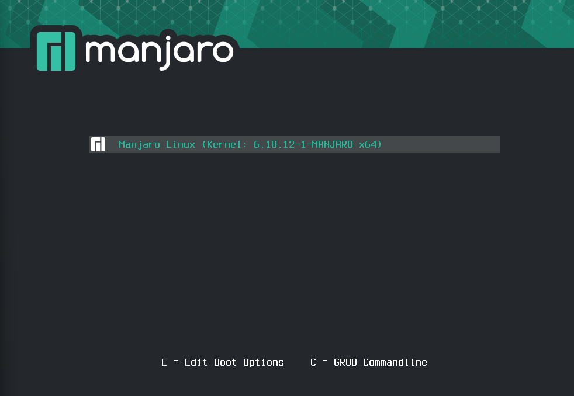

# Teilaufgabe Wieser
\textauthor{Wieser}

## Theoretische Grundlagen der Kernel Treiberentwicklung

### Einführung

Der Kernel ist das Herzstück eines Betriebssystems. Er verwaltet alle zentralen Elemente wie Hardware, Prozesse, Speicher und stellt grundlegende Dienste bereit.

Ein Gerätetreiber ist eine Softwarekomponente, die dem Kernel die Kommunikation mit konkreter Hardware oder einer Gerätekategorie ermöglicht. Typische Beispiele sind Netzwerkschnittstellen oder USB-Geräte. Im Linux-Kernel wird dabei zwischen Kernel-Subsystemen und Gerätetreibern unterschieden. Kernel-Subsysteme stellen eine allgemeine Infrastruktur für bestimmte Aufgabenbereiche bereit, etwa für Geräteverwaltung oder Netzwerke, und definieren dabei Schnittstellen sowie grundlegende Abläufe. Gerätetreiber nutzen diese Subsysteme, um die hardwareabhängige Logik umzusetzen und ein konkretes Gerät anzubinden.

Da Treiber im Kernelspace ausgeführt werden, haben sie einen direkten Einfluss auf die Stabilität, Sicherheit und Leistung des gesamten Systems. Grundlagen wie Initialisierung, Zugriffsschnittstellen und Aufräumlogik sind daher zentrale Bestandteile der Kernelentwicklung [@docs_driver_basics].


Ziel dieses Kapitels ist es, die wichtigsten Konzepte der Linux-Treiberentwicklung verständlich darzustellen. Darauf aufbauend soll der spätere Vergleich einer Implementierung in C mit einer Implementierung in Rust nachvollziehbar werden.

### Kernelspace und Userspace

Ein wesentliches Konzept moderner Betriebssysteme ist die Trennung zwischen Userspace und Kernelspace. Anwendungen im Userspace werden mit eingeschränkten Rechten ausgeführt. Fehler in einer Anwendung betreffen normalerweise nur den eigenen Prozess. Der Kernelspace ist dagegen privilegiert. Code im Kernelspace hat direkten Zugriff auf Hardware und Speicher. Fehler können daher das gesamte System destabilisieren oder sicherheitsrelevante Schwachstellen verursachen.

Treiber und Kernelmodule werden im Linux-System typischerweise im Kernelspace ausgeführt. Aus diesem Grund sind Themen wie Speicherverwaltung, Synchronisation nebenläufiger Abläufe, der Umgang mit Interrupts und saubere Fehlerbehandlung besonders wichtig [@docs_driver_basics].

### Aufbau eines Kernelmoduls

Linux unterstützt Erweiterungen durch *Loadable Kernel Modules*. Solche Module können zur Laufzeit geladen und entladen werden. Dadurch lassen sich Funktionen nachrüsten, ohne das System neu zu starten.

Ein Kernelmodul folgt meist einem klaren Ablauf. Beim Laden wird eine Initialisierung ausgeführt, in der Ressourcen angefordert und Schnittstellen registriert werden. Danach stellt das Modul seine Funktionalität bereit, zum Beispiel über Dateioperationen oder über die Anbindung an ein Kernel-Subsystem. Beim Entladen muss die gesamte Registrierung zurückgenommen und belegter Speicher wieder freigegeben werden. Für die Moduleinbindung werden in C unter anderem `module_init` und `module_exit` verwendet [@docs_driver_basics]. Das Erstellen und Bauen von Modulen erfolgt über *KBuild* [@docs_kbuild_external_modules].

### Rust im Linux Kernel

Rust wurde entwickelt, um systemnahe Programmierung mit erhöhten Sicherheitsgarantien zu ermöglichen. Konzepte wie *Ownership*, *Borrowing* und *Lifetimes* sollen typische Fehlerklassen wie *Use after free*, *ungültige Zeigerzugriffe* oder *Datenrennen* bereits zur Kompilierzeit reduzieren.

Rust ist seit Linux Kernel Version 6.1 im Mainline Kernel enthalten. Nach einer mehrjährigen Integrationsphase wurde Rust im Dezember 2025 als stabil unterstützte Sprache im Kernel akzeptiert. Rust soll C nicht ersetzen, sondern als zusätzliche Option für neue Komponenten und Treiber dienen [@thenewstack_rust_2025] [@heise_rust_kernel_2025].

Die Rust-Schnittstellen im Kernel sind vorhanden und werden weiter ausgebaut. Gleichzeitig sind nicht alle Subsysteme vollständig über Rust erreichbar. Die offizielle Kernel-Dokumentation enthält alle grundlegenden Informationen für den Einstieg in die Rust-Kernel-Entwicklung und alle Programmiernormen, welche befolgt werden müssen[@docs_kernel_rust_index] [@docs_kernel_rust_quickstart].

### Vorteile von Rust im Kernelkontext

Ein zentraler Vorteil von Rust liegt in der strikten Typ und Speichersicherheit. Viele Fehler, die in C erst zur Laufzeit auftreten, werden durch den Rust-Compiler verhindert oder zumindest schwerer möglich gemacht. Gerade im Kernelspace ist das besonders hilfreich.

Rust bietet zudem eine klare Strukturierung durch Module, Traits und explizite Fehlerbehandlung mit `Result` und `Option`, was Wartbarkeit und Lesbarkeit verbessert.

### Herausforderungen bei der Nutzung von Rust

Der Einsatz von Rust im Linux-Kernel ist mit Voraussetzungen verbunden. Die Kernel-Konfiguration muss Rust Unterstützung aktivieren, und die Toolchain muss zu Kernel und Buildsystem passen. Informationen dazu findet man wieder in den Rust-Dokumentationen [@docs_kernel_rust_quickstart]. Zusätzlich ist zu beachten, dass C- und Rust-Code im Kernel koexistieren. Das beeinflusst Workflows, Reviews und Schnittstellen, da der Kernel auf C ausgerichtet ist.

### Kernelarchitektur und Funktionsweise

Der Linux-Kernel ist monolithisch aufgebaut, bietet aber durch Module eine modulare Erweiterbarkeit. Zentrale Komponenten wie Prozessverwaltung, Speicherverwaltung, Dateisysteme, Netzwerk und Gerätetreiber laufen im selben *Adressraum*.

Treiber sind ein integraler Bestandteil des Systems. Systemaufrufe aus dem Userspace gelangen über definierte Schnittstellen in den Kernel und werden dort von Subsystemen oder Treibern verarbeitet. Da Kernel-Subsysteme und Treiber eng zusammenarbeiten, wirken sich Fehler in einem Teil schnell auf das gesamte System aus. Deshalb sind Codequalität, Speichersicherheit und korrekte Synchronisation in der Kernelentwicklung besonders wichtig.


### Kernel-Buildsystem und Modulkompilierung

### KBuild und externe Module

Das Linux-Kernel Buildsystem basiert auf `make` und dem KBuild-System. Externe Module, die nicht direkt in den Kernel-Quellcode integriert sind, werden als Out-of-Tree-Module gegen die installierten Kernel-Header und die passende Kernel-Konfiguration gebaut [@docs_kbuild_external_modules].

```text
obj-m += hello_rust.o

all:
	make -C /lib/modules/$(shell uname -r)/build M=$(PWD) modules

clean:
	make -C /lib/modules/$(shell uname -r)/build M=$(PWD) clean
```

### Buildprozess eines Moduls

Der Buildprozess umfasst Vorverarbeitung, Kompilation und das Erzeugen einer Kernel Objektdatei. Danach kann ein Modul geladen und entladen werden. Für die Praxis sind Werkzeuge wie `insmod`, `modprobe`, `lsmod`, `modinfo` und `dmesg` relevant, da sie Laden, Status und Logs sichtbar machen [@docs_kbuild_external_modules].

### Besonderheiten beim Rust-Build

Rust-Module werden im Kernel nicht mit Cargo gebaut, sondern über KBuild. Der Rust-Compiler wird dabei vom Kernel-Buildsystem angesteuert. Rust-Code im Kernel wird ohne die Rust-Standardbibliothek kompiliert. Stattdessen werden `core` und, falls Heap genutzt wird, `alloc` verwendet [@rust_alloc_docs] [@docs_kernel_rust_index] [@docs_kernel_rust_general_info].

## Praktische Arbeit in Rust

### Rust-for-Linux-Projekt

Das Rust-for-Linux-Projekt verfolgt das Ziel, Kernelmodule und Treiber sicherer zu implementieren, ohne die Kontrolle und Performance systemnaher Entwicklung zu verlieren [@docs_kernel_rust_index] [@docs_kernel_rust_general_info] [@docs_kernel_rust_quickstart]. Rust war innerhalb des Kernels lange Zeit im experimentellen Zustand. Mit Ende 2025 hat Rust jedoch offiziellen Support im Linux-Kernel erhalten und ist damit auch die erste weitere Programmiersprache, der dies gelungen ist [@thenewstack_rust_2025] [@heise_rust_kernel_2025] [@lwn_rust_debate_2025].

### Aufbau eines Rust-Kernelmoduls

Im Gegensatz zu C nutzt Rust kein Header-System. Die Strukturierung erfolgt über Module. Die Registrierung geschieht über ein zentrales Makro, während Initialisierung und Aufräumen über definierte Schnittstellen abgebildet werden[@docs_kernel_rust_index] [@docs_kernel_rust_quickstart].

```rust
#![no_std]
#![no_main]
use kernel::prelude::*;

module! {
    type: HelloRust,
    name: "hello_rust",
    author: "Wieser",
    description: "Beispiel Rust Kernelmodul",
    license: "GPL",
}

struct HelloRust;

impl KernelModule for HelloRust {
    fn init() -> Result<Self> {
        pr_info!("Hello from Rust kernel module\n");
        Ok(HelloRust)
    }
}

impl Drop for HelloRust {
    fn drop(&mut self) {
        pr_info!("Goodbye from Rust kernel module\n");
    }
}
```

### Erklärung des Beispielmoduls

Das Modul besteht aus mehreren klar getrennten Teilen.

1. Die Attribute `#![no_std]` und `#![no_main]` signalisieren, dass der Code ohne Rust-Standardbibliothek kompiliert wird und keine Main-Funktion besitzt.

2. `use kernel::prelude::*;` bindet grundlegende Typen und Traits ein, die für Rust-Kernel-Entwicklung benötigt werden.

3. Das `module!` Makro definiert Metadaten wie Name, Autor und Lizenz. Zusätzlich legt es den Rust-Typ fest, der als Modulinstanz verwendet wird.

4. Die Struktur `HelloRust` repräsentiert den Modulzustand. In diesem minimalen Beispiel enthält sie keine Daten.

5. `KernelModule::init()` wird beim Laden des Moduls ausgeführt. Hier kann Initialisierung erfolgen. Im Beispiel wird lediglich eine Log-Meldung ausgegeben.

6. `Drop` wird beim Entladen des Moduls ausgeführt. Hier können Ressourcen freigegeben werden. Im Beispiel wird ebenfalls nur geloggt.

### Rust-spezifische Eigenschaften im Kernel

Rust erzwingt eine explizite Behandlung von Besitz und Lebensdauern. Das reduziert typische Speicherfehler, die in C durch rohe Pointer entstehen können. Für hardwarenahe Operationen ist weiterhin `unsafe` möglich, es wird aber bewusst markiert und kann dadurch in Reviews leichter geprüft werden.

Fehlerbehandlung erfolgt über typisierte Rückgabewerte, wodurch Fehlersituationen sichtbar bleiben. Synchronisationsmechanismen sind so gestaltet, dass fehlerhafte Nebenläufigkeit erschwert wird [@docs_kernel_rust_general_info] [@lwn_rust_debate_2025].

## Beispiel eines Rust-Character-Device-Treibers

Im Rahmen des praktischen Teils dieser Arbeit habe ich einen einfachen Character-Device-Treiber in Rust geschrieben. Ziel dieses Treibers ist es, eine vergleichbare Funktionalität des C-Treibers meines Projektpartners in Rust umzusetzen. Der Treiber ermöglicht es, über eine Gerätedatei Daten in einen Kernelpuffer zu schreiben und wieder auszulesen. Er implementiert die grundlegenden Dateioperationen `open`, `release`, `read` und `write`.

Beim Laden des Moduls registriert sich der Treiber beim Kernel und erstellt ein Character-Device. Intern verwendet der Treiber einen einfachen Kernelpuffer, in den Daten geschrieben und aus dem Daten wieder gelesen werden können.

Zur Synchronisation werden atomare Variablen sowie ein Mutex verwendet. Diese sorgen dafür, dass parallele Zugriffe korrekt behandelt werden und der Treiber nicht gleichzeitig mehrfach geöffnet werden kann.

```{caption="Rust Character Device Treiber Beispiel" .rs}
#![no_std]
#![no_main]

use kernel::prelude::*;
use kernel::sync::{Mutex, atomic::{AtomicBool, AtomicUsize, Ordering}};

use kernel::chrdev;
use kernel::file::{File, FileOperations};
use kernel::io_buffer::{IoBufferReader, IoBufferWriter};

module! {
    type: CharTestRustModule,
    name: "chartest_rust",
    author: "Wieser",
    description: "Char device module in Rust (open/read/write/release)",
    license: "GPL",
}

const DEVICE_NAME: &CStr = c_str!("chartest");
const BUFFER_SIZE: usize = 1024;

static ALREADY_OPEN: AtomicBool = AtomicBool::new(false);
static OPEN_COUNTER: AtomicUsize = AtomicUsize::new(0);


// Stores bytes written by userspace. LEN tracks valid bytes in the buffer.
static KERNEL_BUFFER: Mutex<[u8; BUFFER_SIZE]> = Mutex::new([0u8; BUFFER_SIZE]);
static KERNEL_BUFFER_LEN: AtomicUsize = AtomicUsize::new(0);

struct CharTestRustModule {
    _reg: chrdev::Registration,
}

impl KernelModule for CharTestRustModule {
    fn init() -> Result<Self> {
        pr_info!("begin {}\n", DEVICE_NAME);

        // Register a character device. Major 0 means dynamic allocation.
        // Depending on kernel version, the constructor name may be new / new_pinned.
        let mut reg = chrdev::Registration::new(0, DEVICE_NAME)?;
        reg.register::<CharTestFile>()?;

        Ok(Self { _reg: reg })
    }
}

impl Drop for CharTestRustModule {
    fn drop(&mut self) {
        // Registration is automatically unregistered on drop.
        pr_info!("finished {}\n", DEVICE_NAME);
    }
}

// File operations for the char device.
// This mirrors the C file_operations: open, release, read, write.
struct CharTestFile;

impl FileOperations for CharTestFile {
    // We do not keep per-open state for now.
    type Data = ();

    // open()
    fn open(_context: &(), _file: &File) -> Result<Self::Data> {
        // Exclusive open, like atomic_cmpxchg in C.
        if ALREADY_OPEN
            .compare_exchange(false, true, Ordering::AcqRel, Ordering::Acquire)
            .is_err()
        {
            return Err(Error::EBUSY);
        }

        let count = OPEN_COUNTER.fetch_add(1, Ordering::Relaxed);
        pr_info!("You opened this {} times\n", count);

        Ok(())
    }

    // release()
    fn release(_data: Self::Data, _file: &File) {
        ALREADY_OPEN.store(false, Ordering::Release);
        pr_info!("closed\n");
    }

    // read()
    fn read(
        _data: &Self::Data,
        _file: &File,
        writer: &mut impl IoBufferWriter,
        offset: u64,
    ) -> Result<usize> {
        let offset = offset as usize;
        let len = KERNEL_BUFFER_LEN.load(Ordering::Acquire);

        if offset >= len {
            return Ok(0);
        }

        let to_copy = core::cmp::min(writer.len(), len - offset);

        let buf = KERNEL_BUFFER.lock();
        writer.write_slice(&buf[offset..offset + to_copy])?;

        Ok(to_copy)
    }

    // write()
    fn write(
        _data: &Self::Data,
        _file: &File,
        reader: &mut impl IoBufferReader,
        _offset: u64,
    ) -> Result<usize> {
        // Cap the write size like the C code (BUFFER_SIZE - 1).
        let mut n = reader.len();
        if n >= BUFFER_SIZE {
            n = BUFFER_SIZE - 1;
        }

        let mut buf = KERNEL_BUFFER.lock();

        // Read from userspace into our kernel buffer.
        // Depending on kernel version, the helper may be read_slice or read_exact.
        reader.read_slice(&mut buf[..n])?;

        // Optional: null-terminate last byte like the C code intent.
        buf[n] = 0;

        KERNEL_BUFFER_LEN.store(n, Ordering::Release);

        pr_info!("successfully written into {}\n", DEVICE_NAME);
        Ok(n)
    }
}
```
### Aufbau des Treibers

1. **Moduldefinition**

   Das `module!` Makro definiert Metadaten des Kernelmoduls wie Name, Autor und Lizenz. Gleichzeitig registriert es die Modulstruktur beim Kernel.

2. **Initialisierung**

   Die Funktion `init()` wird beim Laden des Moduls ausgeführt. Hier erfolgt die Registrierung des Character Devices.

3. **Dateioperationen**

   Die Struktur `CharTestFile` implementiert `FileOperations`. Dadurch werden die Operationen `open`, `release`, `read` und `write` bereitgestellt.

4. **Synchronisation**

   Der Zugriff auf gemeinsame Daten wird über atomare Variablen und einen Mutex abgesichert.

5. **Kernelpuffer**

   Ein statischer Speicherbereich dient als einfacher Datenspeicher für die Kommunikation zwischen Userspace und Kernel.

### Setup, Kernel-Build und Rust-Modul-Entwicklung

### Ziel des praktischen Teils

Im praktischen Teil dieser Arbeit wird untersucht, wie sich die Entwicklung eines einfachen Linux-Kernel-Treibers in der Programmiersprache **Rust** im Vergleich zu **C** gestaltet.

Dazu wurden zwei funktional identische Kernelmodule entwickelt:

- ein Character-Device-Treiber in **C**
- ein Character-Device-Treiber in **Rust**

Beide Treiber implementieren dieselben grundlegenden Funktionen:

- open
- release
- read
- write

Der Fokus liegt dabei nicht auf der Entwicklung eines komplexen Hardwaretreibers, sondern auf der praktischen Untersuchung des Entwicklungsprozesses, der Buildumgebung sowie der Toolchain, die für Programmieren im Linux-Kernel erforderlich ist.

Da mein Projektpartner Ubuntu Linux verwendete, entschied ich mich bewusst für eine andere Distribution als Entwicklungsumgebung. Da Arch und auf Arch basierende Distributionen wie Manjaro meist sehr aktuelle Versionen des Kernels oder Entwicklungswerkzeugen besitzt entschied ich mich für Manjaro.

Die praktische Umsetzung wurde innerhalb einer virtuellen Maschine mithilfe von VirtualBox durchgeführt[@virtualbox_docs].

### Besonderheiten von Rust im Linux-Kernel

Im Vorfeld ist es wichtig zu verstehen, dass Rust im Linux-Kernel nicht als vollständig eigenständige Sprache agiert. Rust-Code im Kernel ist eng mit der bestehenden C-Infrastruktur verbunden. Viele Funktionen und Schnittstellen, die von Rust-Code genutzt werden, sind weiterhin in C implementiert[@futuretim_rust_kernel_blog].

Rust-Code greift dabei häufig über sogenannte *Foreign Function Interfaces (FFI)* auf bestehende Kernel-Funktionen zu[@docs_kernel_rust_general_info].

Damit Rust auf C-Code zugreifen kann, müssen FFI Bindings erzeugt werden. Diese werden automatisch mit dem Tool *bindgen* generiert.

*bindgen* analysiert C-Headerdateien und erzeugt daraus entsprechende Rust-Strukturen und Funktionssignaturen[@rust_bindgen_docs].

Für diesen Prozess wird zusätzlich die *LLVM / Clang*-Toolchain benötigt, da bindgen intern auf *libclang* basiert[@llvm_libclang_docs].

## Vorbereitung der Entwicklungsumgebung

Bevor Kernelmodule entwickelt werden können, muss zunächst geprüft werden, welche Kernelversion auf dem System läuft.

```
uname -r
6.18.12-1-MANJARO
```

Dieser Befehl gibt die aktuell laufende Kernelversion aus.

Kernelmodule werden üblicherweise gegen den *Buildtree* des aktuell laufenden Kernels kompiliert.

Dieser befindet sich normalerweise unter:

```
/lib/modules/$(uname -r)/build
```

`$()` wird im Terminal zur Befehlsausführung innerhalb eines Strings verwendet. Der darin stehende Befehl wird ausgeführt und dessen Ausgabe an dieser Stelle eingefügt.

### Entscheidung für einen eigenen Kernel-Build

Bei der Untersuchung der standardmäßig installierten Kernelkonfiguration von Manjaro zeigte sich zunächst, dass Rust grundsätzlich vom Kernel unterstützt wird. In der Konfiguration war die Option `HAVE_RUST` bereits auf `y` gesetzt. Diese Option wird automatisch aktiviert, wenn die verwendete Architektur Rust grundsätzlich unterstützt.

Gleichzeitig war die eigentliche Kerneloption `RUST`, welche die Rust-Unterstützung im Kernelbuild aktiviert, auf `n` gesetzt. Das bedeutet, dass Rust zwar theoretisch von der Architektur unterstützt wird, aber im konkreten Kernelbuild nicht aktiviert war.

Dadurch konnten Rust-basierte Kernelkomponenten oder Module nicht kompiliert werden, obwohl entsprechende Einträge in der Konfiguration sichtbar waren. Zusätzlich hängen mehrere Rust-bezogene Optionen im Kernel von weiteren Voraussetzungen ab, wie einer kompatiblen Toolchain und korrekt gesetzten Abhängigkeiten innerhalb der Kernelkonfiguration[@rust_kernel_config_guide].

Aus diesem Grund habe ich mich entschieden, den Linux-Kernel selbst zu kompilieren. Dadurch konnte ich die Kernelkonfiguration vollständig kontrollieren und Rust-Unterstützung gezielt aktivieren.

### Eigenen Kernel kompilieren
```
git clone https://github.com/torvalds/linux.git
```
Mit `git clone` wird der Linux-Kernel-Quellcode von GitHub heruntergeladen[@git_clone_docs].

Um eine stabile Ausgangsbasis zu erhalten, kann die Konfiguration des aktuell laufenden Kernels übernommen werden.

```
/proc/config.gz
```

Diese Datei enthält die Konfiguration des aktuell laufenden Kernels.

Die Konfiguration kann mit folgendem Befehl extrahiert werden:

```
zcat /proc/config.gz > .config
```

Damit wird eine `.config` -Datei erzeugt, die als Grundlage für den eigenen Kernel-Build verwendet werden kann.

### Kernelkonfiguration anpassen

Die Kernelkonfiguration kann anschließend angepasst werden:

```
make menuconfig
```

Dieser Befehl öffnet eine textbasierte Konfigurationsoberfläche.

Hier können verschiedene Kerneloptionen aktiviert oder deaktiviert werden.

Um Rust-Unterstützung zu aktivieren, muss die Option `RUST` auf `y` gesetzt werden. Zusätzlich sollten alle damit verbundenen Optionen überprüft und entsprechend angepasst werden.

### Rust-Verfügbarkeit prüfen

Der Kernel bietet einen speziellen Test, um zu überprüfen, ob die Rust-Toolchain korrekt erkannt wird.

```
make LLVM=1 rustavailable
```

Dieser Befehl prüft:

- rustc (rust compiler) Version
- bindgen Verfügbarkeit
- clang / llvm Installation
- rust source Komponenten

Während dieser Überprüfung traten bei mir verschiedene Fehlermeldungen auf. Diese waren hautpsächlich Versionkonflikte zwischen der installierten Rust-Version und den Anforderungen des Kernels. Zusätzlich gab es Probleme mit der Erkennung von bindgen, da dieses nicht korrekt installiert oder im PATH verfügbar war. Diese Probleme wurden durch die Installation einer passenden Rust-Version und die Sicherstellung, dass bindgen korrekt installiert und im PATH verfügbar ist, behoben.

### Rust-Toolchain-Setup

Für die Arbeit mit Rust im Linux-Kernel wird eine funktionierende Rust-Toolchain benötigt, die folgende Werkzeuge umfasst:

- rustc
- cargo
- rust-src
- bindgen

Die aktuelle Rust-Version kann mit folgendem Befehl geprüft werden:

```
rustc --version
1.74.1
```

Da bestimmte Kernelversionen nur mit bestimmten Rust Versionen kompatibel sind, wird rustup verwendet, um eine passende Rust-Version festzulegen[@rustup_docs].

```
rustup override set 1.x.x
```

Dieser Befehl legt fest, dass im aktuellen Verzeichnis diese Rust-Version verwendet wird.

Zusätzlich muss die Rust Standardbibliothek als Source-Code verfügbar sein.

```
rustup component add rust-src
```

Ohne diese Komponente können bestimmte Kernel-Builds nicht durchgeführt werden.

### bindgen

Die jetzige bindgen-Version kann mit folgendem Befehl geprüft werden:

```
bindgen --version
0.59.2
```

Falls bindgen über cargo installiert wurde, muss der Cargo-Binary-Pfad zum PATH hinzugefügt werden.

```
export PATH="$HOME/.cargo/bin:$PATH"
```

### Kernel-Build

Nachdem alle Voraussetzungen erfüllt waren, konnte der Kernel-Build gestartet werden.

```
make LLVM=1 -j$(nproc)
```


Der Befehl `make` startet den Kompilierungsprozess anhand der im Projekt enthaltenen Makefiles. Der Parameter `LLVM=1` sorgt dafür, dass clang / llvm für den Build verwendet werden. Der Parameter `-j$(nproc)` startet einen parallelen Build mit allen verfügbaren CPU-Kernen.

### Kernel-Installation

Nach erfolgreichem Build kann der Kernel installiert werden.

```
sudo make modules_install
sudo make install
```

Diese Befehle installieren:

- Kernel-Module
- Kernel-Image
- Bootloader-Einträge

Nach einem Neustart kann geprüft werden, ob der neue Kernel aktiv ist.

```
uname -r
7.0.0-rc1-MANJARO
```
Der neue Kernel erschien aber nicht direkt im Bootmenü. Ich musste den Bootloader manuell aktualisieren, damit der neue Kernel als Startoption verfügbar war. Nach der Aktualisierung konnte der neue Kernel ausgewählt und gestartet werden.

{width=90%}

### Externe Kernelmodule kompilieren

Kernelmodule können außerhalb des Kernel-Source-Trees entwickelt werden.

Dies wird als **Out-of-tree-Build** bezeichnet.

```
make -C /lib/modules/$(uname -r)/build M=$(pwd) modules
```

Der Parameter `-C /lib/modules/$(uname -r)/build` weist `make` an, zunächst in das Buildverzeichnis des aktuell laufenden Kernels zu wechseln. Dort befindet sich der Kernel-Buildtree mit den benötigten Makefiles und Konfigurationsdateien.

Mit `M=$(pwd)` wird dem Kernel-Buildsystem mitgeteilt, dass sich der Quellcode des zu kompilierenden Moduls im aktuellen Verzeichnis befindet (`pwd` gibt den aktuellen Ordner aus).

Der Parameter `modules` gibt schließlich an, dass nur die in diesem Verzeichnis enthaltenen Kernelmodule gebaut werden sollen und nicht der komplette Kernel.


### Aufgetretene Probleme

Während der praktischen Umsetzung traten mehrere Probleme auf.
Diese standen hauptsächlich im Zusammenhang mit der Rust-Toolchain.

#### bindgen nicht gefunden

Ein häufiger Fehler war:

```
Rust bindings generator 'bindgen' could not be found
```

Dies bedeutet, dass bindgen nicht installiert oder nicht im Pfad vorhanden ist.

### Rust-Versionskonflikte

Mehrfach traten Konflikte zwischen Kernelversion und rustc-Version auf.

```
rustc is too old
rustc is too new
```

Dies zeigt, dass bestimmte Kernelversionen nur mit bestimmten Rust-Versionen getestet wurden.

### Unknown unstable option

```
unknown unstable option: no-jump-tables
```

Dieser Fehler entsteht, wenn der Kernel-Buildprozess Rust-Compiler-Optionen verwendet, die von der aktuell installierten Rust-Version nicht unterstützt werden. Um das Problem zu beheben, muss entweder die Rust-Version aktualisiert oder auf eine Version zurückgesetzt werden, die mit den verwendeten Compiler-Optionen kompatibel ist.

### Weitere Compiler-Probleme

Zusätzlich traten Fehler im Zusammenhang mit:

- libbpf
- BTF-Debug-Informationen
- C23-Compiler-Optionen

auf.

Diese Fehler entstehen häufig durch Unterschiede in Compiler-Versionen oder Build-Flags. Die Lösung besteht darin, die verwendeten Compiler und deren Versionen zu überprüfen und sicherzustellen, dass sie mit den Anforderungen des Kernel-Builds kompatibel sind.